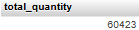
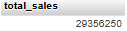

# 📊 Customer & Product Analytics Report

## Overview
This project explores and analyzes key customer and product behaviors using SQL queries. The results aim to help business decision-making through segmentation, performance evaluation, and KPI development.

---

## 🔍 Roadmap

### 🧭 Exploratory Data Analysis (EDA)
1. **Database Exploration** – Overview of tables and structure.  
[Script](scripts/1_database_exploration.sql)

2. **Dimensions Exploration** – Review of dimensions like customer, product, and date.  
[Script](scripts/2_dimensions_exploration.sql)  

3. **Date Exploration** – Understanding the range and granularity of dates.  
[Script](scripts/3_date_range_exploration.sql)  

  

4. **Measures Exploration** – Review of core metrics such as sales, quantity, and orders.  
[Script](scripts/4_measures_exploration.sql)
  
  

5. **Magnitude** – Evaluating the total size and impact of sales.  
[Script](scripts/5_magnitude_analysis.sql)
  

6. **Ranking** – Identifying top customers and top products.  
[Script](scripts/6_ranking_analysis.sql)
### 📈 Advanced Analytics
7. **Change Over Time** – Analyze sales trends across months/years.  
[Script](scripts/7_change_over_time_analysis.sql)
8. **Cumulative Analysis** – Cumulative sales and orders per segment.  
[Script](scripts/8_cumulative_analysis.sql)
9. **Performance Analysis** – Identify high and low performers among customers and products.  
[Script](scripts/9_performance_analysis.sql)
10. **Part to Whole** – Understand customer/product contributions to overall performance.  
[Script](scripts/10_data_segmentation.sql)
11. **Data Segmentation** – Grouping by revenue, frequency, recency, and more.  
[Script](scripts/11_part_to_whole_analysis.sql)
12. **Reporting** – Consolidated views with metrics and KPIs.  
[Script](scripts/12_report_customers.sql)
---

## 📋 Customer Report

**Purpose**:  
Consolidates key customer metrics and behaviors for business insight.

**Highlights**:
1. Gathers essential fields such as names, ages, and transaction details.
2. Segments customers into categories (VIP, Regular, New) and age groups.
3. Aggregates customer-level metrics:
   - Total orders  
   - Total sales  
   - Total quantity purchased  
   - Total products  
   - Lifespan (in months)
4. Calculates valuable KPIs:
   - Recency (months since last order)  
   - Average Order Value (AOV)  
   - Average Monthly Spend  

[Script](scripts/12_report_customers.sql)  
🖼️ *[Optional]*: Includes screenshots of key result tables for reference.

---

## 📦 Product Report

**Purpose**:  
Consolidates key product metrics and performance indicators.

**Highlights**:
1. Gathers essential fields such as product name, category, subcategory, and cost.
2. Segments products by revenue to identify:
   - High-Performers  
   - Mid-Range  
   - Low-Performers
3. Aggregates product-level metrics:
   - Total orders  
   - Total sales  
   - Total quantity sold  
   - Total unique customers  
   - Lifespan (in months)
4. Calculates valuable KPIs:
   - Recency (months since last sale)  
   - Average Order Revenue (AOR)  
   - Average Monthly Revenue  
[Script](scripts/13_report_products.sql)  
  
🖼️ 

---

## ✅ Technologies Used
- phpMyAdmin – For database exploration and SQL execution
- MySQL – As the relational database system
- Markdown – To document and present the project
- Excel (for tabular exports)

---

## ✍️ Author
Donají Ramos Nuñez  
donajiramosn@gmail.com

