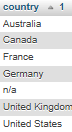

# 📊 Customer & Product Analytics Report

## Overview  
This project explores and analyzes key customer and product behaviors using SQL queries. The results aim to support business decision-making through segmentation, performance evaluation, and KPI development.

---

## 🔍 Roadmap  

---

### 🧭 Exploratory Data Analysis (EDA)

1. **Database Exploration** – Overview of tables and structure.  
   [Script](scripts/1_database_exploration.sql)  
     
   *Displays the general structure of the database.*

2. **Dimensions Exploration** – Review of dimensions like customer, product, and date.  
   [Script](scripts/2_dimensions_exploration.sql)  
     
   *Shows customer distribution across countries.*

3. **Date Exploration** – Understanding the range and granularity of dates.  
   [Script](scripts/3_date_range_exploration.sql)  
     
   *The earliest date in the dataset.*  
     
   *The most recent date available.*

4. **Measures Exploration** – Review of core metrics such as sales, quantity, and orders.  
   [Script](scripts/4_measures_exploration.sql)  
     
   *Key performance metrics extracted from the data.*

5. **Magnitude** – Evaluating the total size and impact of sales.  
   [Script](scripts/5_magnitude_analysis.sql)  
     
    The United States has the highest number of customers (7,482), making it the largest market, followed by Australia with 3,591. This suggests a strong sales presence in the U.S.  

     
   The gender distribution is quite balanced: 9,341 male and 9,128 female customers, indicating that the products appeal almost equally to both genders.  

     
   The Components category has the most products (127), highlighting a focus on individual parts rather than finished items like clothing or bikes.  

      
   Although components are more numerous, the Bikes category generates the most revenue, with over 28 million, suggesting that high-value items drive revenue.  

     
   The top five customers generate almost the same revenue individually (~13,298), showing a similar purchasing behavior among the most valuable clients.  

   
     
    Once again, the United States leads with 20,481 sold items, confirming its dominance not only in customer count but also in sales volume.
   *Provides various breakdowns of total revenue by key dimensions.*

6. **Ranking** – Identifying top customers and top products.  
   [Script](scripts/6_ranking_analysis.sql)  
   - Top 5 products by revenue  
       
   - Worst performing sales  
       
   - Top revenue by customers  
       
   - Customers with fewest orders  
       
   *Ranks the best and worst performers in terms of revenue and activity.*

---

### 📈 Advanced Analytics

7. **Change Over Time** – Analyze sales trends across months/years.  
   [Script](scripts/7_change_over_time_analysis.sql)  
     
   *Shows changes in performance over time.*

8. **Cumulative Analysis** – Cumulative sales and orders per segment.  
   [Script](scripts/8_cumulative_analysis.sql)  
     
   *Highlights the accumulation of KPIs over time.*

9. **Performance Analysis** – Identify high and low performers among customers and products.  
   [Script](scripts/9_performance_analysis.sql)  
     
   *Compares performance across customers and products.*

10. **Part to Whole** – Understand customer/product contributions to overall performance.  
    [Script](scripts/10_data_segmentation.sql)  
      
      
    *Visualizes how different segments contribute to global results.*

11. **Data Segmentation** – Grouping by revenue, frequency, recency, and more.  
    [Script](scripts/11_part_to_whole_analysis.sql)  
      
    *Segments customers and products using behavioral metrics.*

12. **Reporting** – Consolidated views with metrics and KPIs.  
    [Script](scripts/12_report_customers.sql)  
    *Combines previous results into final reports.*

---

## 📋 Customer Report

**Purpose**:  
Consolidates key customer metrics and behaviors for business insight.

**Highlights**:
1. Gathers essential fields such as names, ages, and transaction details.  
2. Segments customers into categories (VIP, Regular, New) and age groups.  
3. Aggregates customer-level metrics:
   - Total orders  
   - Total sales  
   - Total quantity purchased  
   - Total products  
   - Lifespan (in months)  
4. Calculates valuable KPIs:
   - Recency (months since last order)  
   - Average Order Value (AOV)  
   - Average Monthly Spend  

[Script](scripts/12_report_customers.sql)  
🖼️   
[Download Report (CSV)](gold_report_customers.csv)

---

## 📦 Product Report

**Purpose**:  
Consolidates key product metrics and performance indicators.

**Highlights**:
1. Gathers essential fields such as product name, category, subcategory, and cost.  
2. Segments products by revenue to identify:
   - High-Performers  
   - Mid-Range  
   - Low-Performers  
3. Aggregates product-level metrics:
   - Total orders  
   - Total sales  
   - Total quantity sold  
   - Total unique customers  
   - Lifespan (in months)  
4. Calculates valuable KPIs:
   - Recency (months since last sale)  
   - Average Order Revenue (AOR)  
   - Average Monthly Revenue  

[Script](scripts/13_report_products.sql)  
🖼️   
[Download Report (CSV)](gold_report_products.csv)

---

## ✅ Technologies Used
- **phpMyAdmin** – For database exploration and SQL execution  
- **MySQL** – Relational database system  
- **Markdown** – For documenting and structuring the report  
- **Excel** – For tabular exports and reporting  

---

## ✍️ Author  
**Donají Ramos Nuñez**  
📧 donajiramosn@gmail.com
